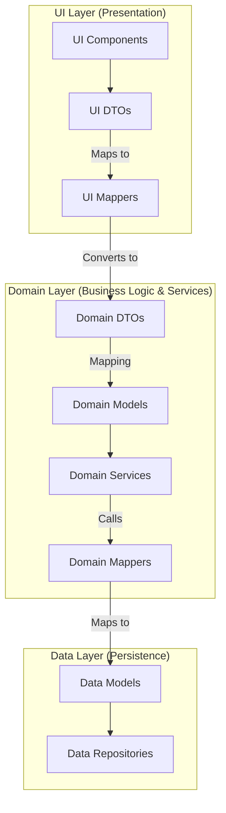

# Application.Mappers

## Overview

The `Application.Mappers` project is designed to handle all mapping logic for the application layer. This project follows the principle of separation of concerns, ensuring that mapping logic is kept separate from other parts of the application.

## Purpose

The sole purpose of the `Application.Mappers` project is to contain mapping classes responsible for converting data transfer objects (DTOs) to domain models and vice versa.

## Key Features

- **Separation of Concerns**: By isolating mapping logic in its own project, we ensure that the application remains modular and maintainable. This separation allows for easier testing and modification of mappers without affecting other parts of the application.
- **Custom Mapping Logic**: Implement custom mapping logic specific to the application's requirements.
- **Common.Mappers Library**: Makes use of the `Common.Mappers` library to abstract away key functionality, providing shared functionality and ensuring consistency across mappers.

## Structure

The `Application.Mappers` project typically contains the following components:

- **Mapping Classes**: Classes that implement mapping logic for specific DTOs.
- **Interfaces**: Interfaces that define the contract for mapping services.
- **Base Classes**: Base classes that provide common mapping functionality.

## Example

Here is an example of a mapper in the `Application.Mappers` project:

```csharp
public class ProductDtoMapper : TwoWayMapperBase<ProductDto, Product>, IProductDtoMapper 
{
    public override ProductDto Map(Product obj)
    {
        ArgumentNullException.ThrowIfNull(obj);
        
        return new()
        {
            Id = obj.Id,
            Name = obj.Name,
            Price = obj.Price,
        };
    }

    public override Product Map(ProductDto obj)
    {
        ArgumentNullException.ThrowIfNull(obj);
        
        return new()
        {
            Id = obj.Id,
            Name = obj.Name,
            Price = obj.Price,
        };
    }
}
```

## Usage
To use a mapping class, inject it into the relevant service and call the Map method with the object to be mapped. Handle any exceptions as needed.

## Conclusion
The Application.Mappers project is a crucial part of the application layer architecture, ensuring that mapping logic is cleanly separated and easily maintainable. By adhering to the principle of separation of concerns, we create a more modular and testable application layer.

