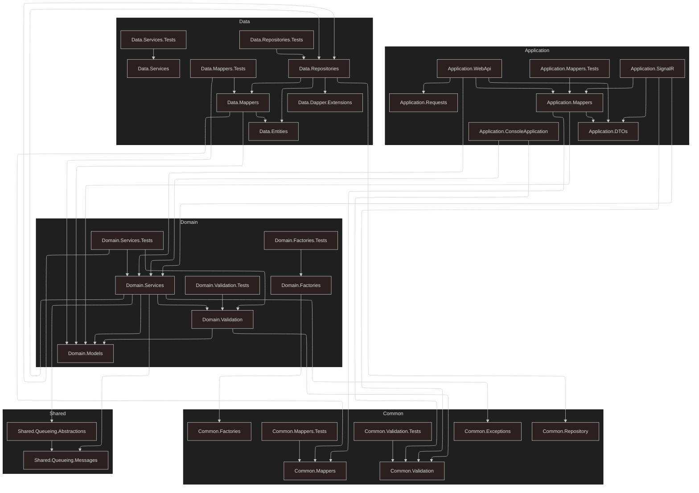

# ExampleBestPracticeConsoleApp

## Architecture

```mermaid
---
config:
  theme: neo-dark
  look: classic
  layout: elk
---
flowchart TD
 subgraph Application["Application"]
        Application.ConsoleApplication["Application.ConsoleApplication"]
        Application.DTOs["Application.DTOs"]
        Application.Mappers["Application.Mappers"]
        Application.Mappers.Tests["Application.Mappers.Tests"]
        Application.SignalR["Application.SignalR"]
        Application.WebApi["Application.WebApi"]
        Application.Requests["Application.Requests"]
  end
 subgraph Common["Common"]
        Common.Mappers.Tests["Common.Mappers.Tests"]
        Common.Validation.Tests["Common.Validation.Tests"]
        Common.Repository["Common.Repository"]
        Common.Factories["Common.Factories"]
        Common.Exceptions["Common.Exceptions"]
        Common.Mappers["Common.Mappers"]
        Common.Validation["Common.Validation"]
  end
 subgraph Data["Data"]
        Data.Mappers["Data.Mappers"]
        Data.Entities["Data.Entities"]
        Data.Mappers.Tests["Data.Mappers.Tests"]
        Data.Repositories["Data.Repositories"]
        Data.Dapper.Extensions["Data.Dapper.Extensions"]
        Data.Repositories.Tests["Data.Repositories.Tests"]
        Data.Services.Tests["Data.Services.Tests"]
        Data.Services["Data.Services"]
  end
 subgraph Domain["Domain"]
        Domain.Factories["Domain.Factories"]
        Domain.Factories.Tests["Domain.Factories.Tests"]
        Domain.Validation["Domain.Validation"]
        Domain.Services.Tests["Domain.Services.Tests"]
        Domain.Validation.Tests["Domain.Validation.Tests"]
        Domain.Services["Domain.Services"]
        Domain.Models["Domain.Models"]
  end
 subgraph Shared["Shared"]
        Shared.Queueing.Abstractions["Shared.Queueing.Abstractions"]
        Shared.Queueing.Messages["Shared.Queueing.Messages"]
  end
    Application.ConsoleApplication --> Domain.Services & Common.Validation
    Application.Mappers --> Application.DTOs & Common.Mappers & Domain.Models
    Application.Mappers.Tests --> Application.Mappers
    Application.SignalR --> Application.DTOs & Application.Mappers & Domain.Services & Common.Validation
    Application.WebApi --> Application.DTOs & Application.Mappers & Application.Requests & Domain.Services
    Common.Mappers.Tests --> Common.Mappers
    Common.Validation.Tests --> Common.Validation
    Data.Mappers --> Common.Mappers & Data.Entities & Domain.Models
    Data.Mappers.Tests --> Data.Mappers & Domain.Models
    Data.Repositories --> Common.Repository & Data.Dapper.Extensions & Data.Entities & Data.Mappers
    Data.Repositories.Tests --> Data.Repositories
    Data.Services.Tests --> Data.Services
    Domain.Factories --> Common.Factories
    Domain.Factories.Tests --> Domain.Factories
    Domain.Services --> Common.Exceptions & Data.Repositories & Domain.Models & Domain.Validation & Shared.Queueing.Abstractions & Shared.Queueing.Messages
    Domain.Services.Tests --> Data.Repositories & Domain.Services & Domain.Validation
    Domain.Validation --> Common.Validation & Domain.Models
    Domain.Validation.Tests --> Domain.Validation
    Shared.Queueing.Abstractions --> Shared.Queueing.Messages


```